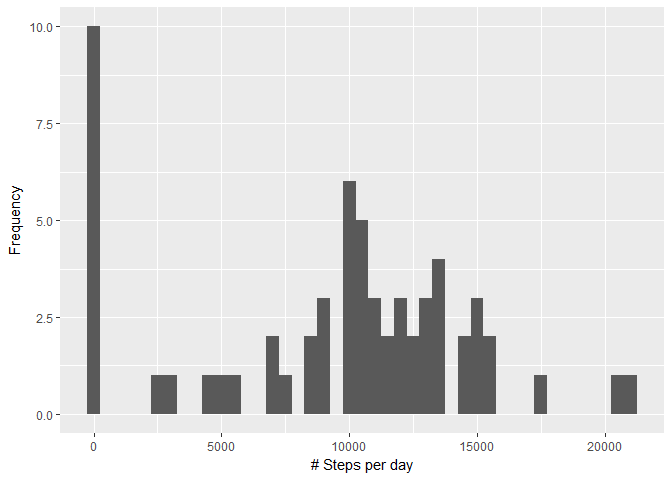
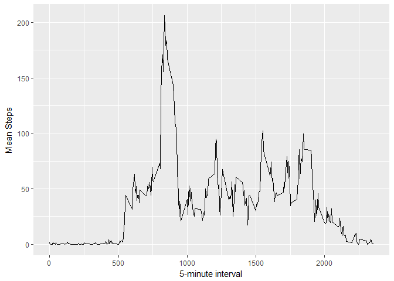
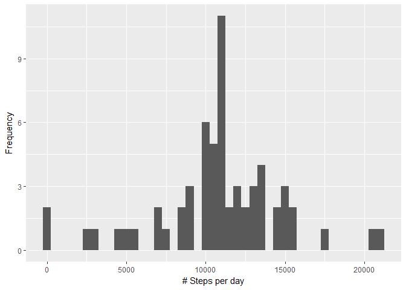
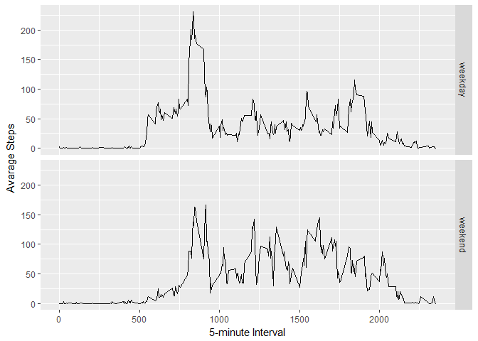

# Reproducible Research: Peer Assessment 1


## Loading and preprocessing the data


```r
library(dplyr)
```

```
## 
## Attaching package: 'dplyr'
```

```
## The following objects are masked from 'package:stats':
## 
##     filter, lag
```

```
## The following objects are masked from 'package:base':
## 
##     intersect, setdiff, setequal, union
```

```r
library(ggplot2)
```


```r
activity <- read.csv("activity.csv")
activity$steps <- as.numeric(activity$steps)
activity$date <- as.Date(activity$date, "%Y-%m-%d")
```


## What is mean total number of steps taken per day?

Total steps per day:


```r
grp_steps_day <- group_by(activity,date)
total_steps <- summarise(grp_steps_day, total_steps = sum(steps,na.rm = TRUE))
qplot(total_steps$total_steps, geom = "histogram",xlab="# Steps per day", ylab="Frequency", binwidth=500)
```

<!-- -->

```r
stepsmean <- mean(total_steps$total_steps)
stepsmedian <- median(total_steps$total_steps)
```


- Mean = 9354.2295082
- Median = 1.0395\times 10^{4}

## What is the average daily activity pattern?

Average by interval:


```r
grp_steps_interval <- group_by(activity,interval)
average_steps <- summarise(grp_steps_interval, average_steps = mean(steps,na.rm = TRUE))
qplot(x = average_steps$interval, y = average_steps$average_steps,geom = "line",xlab="5-minute interval", ylab="Mean Steps")
```

<!-- -->

```r
max<-max(average_steps$average_steps)
intervalmax <- average_steps[which(average_steps$average_steps==max),1]
```

The interval 835 contain the maximum average steps, which is 206.1698113

## Imputing missing values


```r
total_na <- sum(is.na(activity$steps))
activity_nNA <- activity

for (i in 1:dim(activity_nNA)[1]){
  if(is.na(activity_nNA[i,1])){
    activity_nNA[i,1] <- average_steps[activity_nNA[i,3]==average_steps$interval,2]
  }
}

grp_steps_day2 <- group_by(activity_nNA,date)
total_steps2 <- summarise(grp_steps_day2, total_steps = sum(steps,na.rm = TRUE))
qplot(total_steps2$total_steps, geom = "histogram",xlab="# Steps per day", ylab="Frequency", binwidth=500)
```

<!-- -->

```r
stepsmean2 <- mean(total_steps2$total_steps)
stepsmedian2 <- median(total_steps2$total_steps)
```

- Total NAs = 2304
- Mean without NA = 1.0766189\times 10^{4}
- Median without NA = 1.0766189\times 10^{4}

As expected, adding values to the NA rows in the dateset has changed the mean and median observed. Depeding on the purpose of these calculations, these impacts can alter the conclusions taken in the experiment.

## Are there differences in activity patterns between weekdays and weekends?


```r
activity_nNA$weekday <- ifelse(weekdays(activity_nNA$date)%in%c("sábado","domingo"),"weekend","weekday")
activity_nNA$weekday <- as.factor(activity_nNA$weekday)

grp_steps_interval2 <- group_by(activity_nNA,interval,weekday)
average_steps2 <- summarise(grp_steps_interval2, average_steps = mean(steps,na.rm = TRUE))
ggplot(average_steps2, aes(interval, average_steps)) + geom_line() + facet_grid (weekday~.)+
    xlab("5-minute Interval") + 
    ylab("Avarage Steps")
```

<!-- -->
